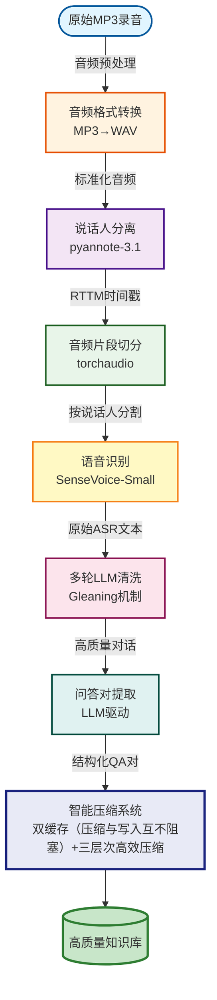
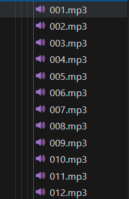
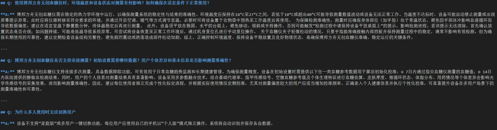
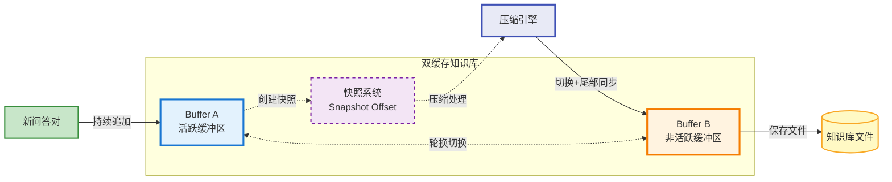
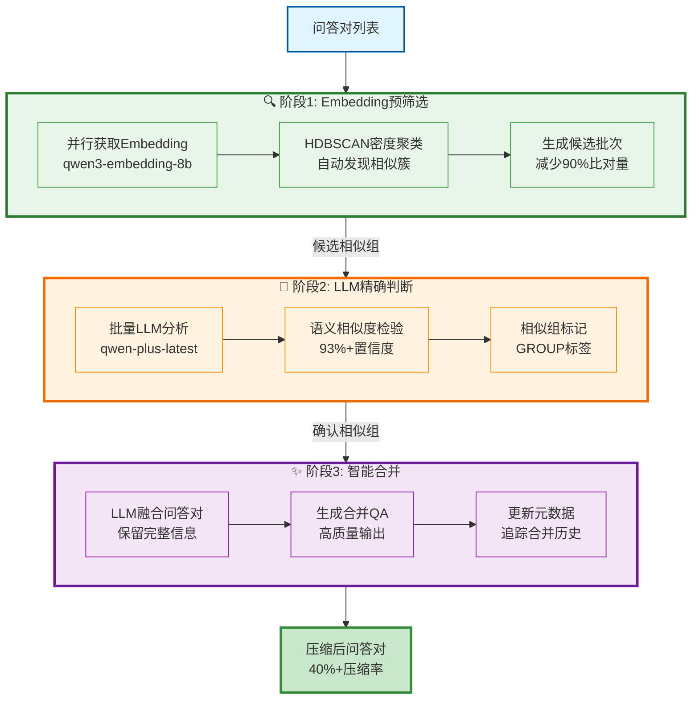

# 端到端客服录音知识库提取系统

> 🎯 企业级批量MP3录音转高质量知识库的端到端解决方案

一个专为客服场景设计的音频处理系统，能够将大量客服对话录音批量转换为结构化的高质量知识库语料，为RAG智能客服提供可靠的数据基础。

## ⚡ 核心亮点

### 🎯 解决实际业务痛点
- **端到端批量处理**：一键处理大量MP3录音文件，无需人工干预
- **企业级架构**：统一配置管理、异步处理、智能资源管理
- **高质量输出**：通过多轮清洗和智能压缩，确保知识库质量

### 🚀 技术创新特性
- **Gleaning多轮清洗机制**：LLM驱动的迭代优化，显著提升文本质量
- **异步LLM处理器**：支持高并发处理，大幅提升处理效率
- **双缓存压缩系统**：智能压缩算法，避免知识库无限膨胀
- **防灾难性遗忘**：创新的增量压缩机制，保持知识库一致性
- **自动资源管理**：动态清理中间文件，确保系统资源可控

### 🎨 处理流程优势
与传统ASR方案相比，本系统专门优化了：
- **强噪声环境**：客服录音的复杂声学环境处理
- **角色识别清晰**：精确的说话人分离和对话还原
- **完整工作流**：填补市场空白的端到端开源解决方案

## 📋 系统架构

### 端到端处理流程



### 核心技术栈

#### 🧠 AI模型层
- **说话人分离**：`pyannote/speaker-diarization-3.1` - 基于深度学习的精确说话人识别
- **语音识别**：`SenseVoice-Small` - 阿里开源多语言ASR模型，本地部署
- **文本处理**：`qwen-plus-latest` - 阿里云通义千问大语言模型

#### 🏗️ 系统架构层
- **配置管理**：分层YAML配置系统，支持多环境部署
- **并发处理**：基于ThreadPoolExecutor的异步任务调度
- **音频处理**：PyTorch生态的torchaudio音频处理库
- **智能压缩**：LLM驱动的相似度检验和知识合并

#### 📊 数据处理层
- **格式转换**：智能音频格式检测和转换
- **精确切分**：基于RTTM时间戳的毫秒级音频分割
- **质量控制**：多轮Gleaning清洗和质量评估
- **知识构建**：结构化QA对提取和层次化组织

## 🛠️ 快速开始

### 环境要求

- **Python**: 3.12
- **GPU**: CUDA兼容显卡 (推荐GTX 1080以上，理论上pyannote+senseVoice需约2GB显存)
- **内存**: 16GB+ RAM (推荐32GB)
- **存储**: 50GB+ 可用空间

### 安装步骤

1. **克隆项目**
```bash
git clone <repository-url>
cd end2end_autio2kg
```

2. **安装依赖**
```bash
# 安装PyTorch (CUDA版本)
pip install torch torchvision torchaudio 

# 安装项目依赖
pip install -r requirements.txt
```

3. **配置环境变量**
```bash
cp .env.example .env
# 编辑 .env 文件，配置必要的API密钥
```

必需配置：
```bash
# Hugging Face访问令牌 (用于pyannote模型)
HUGGINGFACE_TOKEN=hf_your_token_here

# 阿里云API配置 (用于LLM清洗)
DASHSCOPE_API_KEY=sk-your_api_key_here
DASHSCOPE_BASE_URL=https://dashscope.aliyuncs.com/compatible-mode/v1
```

4. **准备模型**
```bash
# SenseVoice模型会在首次运行时自动下载到 models/senseVoice-small/
```

### 运行系统

1. **放置音频文件**
```bash
# 将MP3文件放入 data/input/ 目录
cp your_recordings/*.mp3 data/input/
```

2. **启动处理**
```bash
python main.py
```

3. **查看结果**
```bash
# 处理结果会保存在 data/output/ 目录
# 最终知识库文件：data/output/knowledgeDatabase.md
```

### 示例展示

**输入数据示例**:


**输出数据示例**:


## 📁 项目结构

```
end2end_autio2kg/
├── main.py                     # 主程序入口
├── requirements.txt            # 项目依赖
├── .env.example               # 环境变量模板
│
├── config/                    # 🔧 统一配置管理系统
│   ├── manager.py             # 配置管理器核心
│   ├── schemas/               # 配置模式定义
│   ├── defaults/              # 默认配置文件
│   │   ├── system.yaml        # 系统配置
│   │   ├── models.yaml        # 模型配置
│   │   ├── processing.yaml    # 处理配置
│   │   ├── compaction.yaml    # 压缩配置
│   │   ├── concurrency.yaml   # 并发配置
│   │   ├── algorithms.yaml    # 算法配置
│   │   └── business.yaml      # 业务配置
│   ├── environments/          # 环境特定配置
│   └── local/                 # 本地覆盖配置
│
├── src/                       # 🧩 核心源代码
│   ├── core/                  # 核心处理模块
│   │   ├── diarization.py     # 说话人分离
│   │   ├── audio_segmentation.py # 音频切分
│   │   ├── asr.py             # 语音识别
│   │   ├── llm_cleaner.py     # LLM数据清洗
│   │   ├── async_llm_processor.py # 异步LLM处理器
│   │   ├── qa_extractor.py    # QA提取器
│   │   ├── qa_compactor.py    # QA压缩器
│   │   ├── knowledge_base.py  # 知识库管理 (双缓存系统)
│   │   ├── knowledge_integration.py # 知识库集成
│   │   └── embedding_similarity.py # 相似度计算
│   └── utils/                 # 工具模块
│       ├── audio_converter.py # 音频格式转换
│       ├── processor.py       # 统一处理器
│       ├── logger.py          # 日志管理
│       ├── concurrency.py     # 并发控制
│       └── file_cleaner.py    # 文件清理工具
│
├── data/                      # 📊 数据目录
│   ├── input/                 # 输入数据 (MP3文件)
│   ├── processed/             # 处理中数据
│   │   ├── wavs/             # WAV格式文件
│   │   └── rttms/            # 说话人分离结果
│   └── output/               # 输出数据
│       └── docs/             # 最终处理结果
│
└── models/                   # 🤖 模型目录
    └── senseVoice-small/    # 本地SenseVoice模型
```

## ⚙️ 配置系统

### 分层配置架构

系统采用分层配置管理，支持灵活的环境配置和参数调优：

```yaml
# 配置优先级：环境变量 > 本地配置 > 环境配置 > 默认配置
config/
├── defaults/           # 基础默认配置
├── environments/       # 环境特定配置 (dev/test/prod)
└── local/             # 本地覆盖配置 (不纳入版本控制)
```

### 核心配置说明

#### 系统配置 (`system.yaml`)
```yaml
device:
  cuda_device: "cuda:1"     # GPU设备设置

paths:
  project_root: "."         # 项目根路径
  sensevoice_model: "models/senseVoice-small"  # ASR模型路径
```

#### 处理配置 (`processing.yaml`)
```yaml
batch:
  enable_async_llm: true         # 启用异步LLM处理
  enable_knowledge_base: true    # 启用知识库集成
  enable_gleaning: true          # 启用Gleaning多轮清洗
  max_gleaning_rounds: 3         # 最大清洗轮数
```

#### 并发配置 (`concurrency.yaml`)
```yaml
async_llm:
  max_concurrent_tasks: 16       # 最大并发LLM任务数
  max_retries: 2                 # 最大重试次数
```

## 🔄 处理流程详解

### 1. 音频预处理阶段
- **格式检测**：自动识别音频格式，统一转换为WAV
- **质量验证**：检查音频完整性和采样率
- **路径管理**：规范化文件命名和目录结构

### 2. 说话人分离阶段
- **模型加载**：pyannote/speaker-diarization-3.1深度学习模型
- **分离处理**：生成RTTM格式的时间戳文件
- **GPU加速**：支持CUDA加速，显著提升处理速度

### 3. 音频切分阶段
- **精确切分**：基于RTTM时间戳进行毫秒级切分
- **文件命名**：`{序号}_{说话人ID}-{起始时间}-{结束时间}.wav`
- **批量处理**：支持大规模音频文件的并行切分

### 4. 语音识别阶段
- **本地部署**：SenseVoice-Small模型本地推理
- **多语言支持**：支持中英文混合识别
- **高精度输出**：针对客服场景优化的识别准确率

### 5. LLM清洗阶段 (核心创新)
- **Gleaning机制**：多轮迭代清洗，每轮基于上一轮结果优化
- **异步处理**：支持16并发任务，大幅提升处理效率
- **质量控制**：智能评估清洗效果，动态调整清洗策略
- **专业优化**：针对医疗设备客服对话的专门清洗策略

### 6. QA提取阶段
- **智能识别**：基于LLM的问答对自动识别和提取
- **结构化输出**：生成标准格式的QA对数据
- **质量评估**：对提取的QA对进行质量评分和筛选

### 7. 智能压缩阶段 (核心创新)

#### 🎯 双缓存系统架构


#### ⚙️ 三阶段智能压缩策略


**核心特性**:
- **智能预筛选**: Embedding+HDBSCAN聚类，减少90%无效比对
- **LLM精确判断**: 93%+相似度检测置信度
- **避免遗忘**: 尾部增量同步机制，保持知识完整性
- **双缓存设计**: 活跃/非活跃缓冲区轮换，零阻塞写入

## 🎯 核心算法

### Gleaning多轮清洗算法

```python
# 多轮迭代清洗流程
for round in range(max_rounds):
    cleaned_text = llm_clean(
        text=previous_result,
        context=business_context,
        round_number=round
    )

    quality_score = evaluate_quality(cleaned_text)
    if quality_score > threshold:
        break

    previous_result = cleaned_text
```

**特性**：
- 每轮基于上一轮结果进行优化
- 动态质量评估和提前终止
- 专门针对客服对话场景的清洗策略

### 智能压缩算法

```python
# 三阶段压缩流程
def compress_qa_pairs(qa_pairs):
    # 阶段1: Embedding预过滤
    candidates = embedding_prefilter(qa_pairs, threshold=0.85)

    # 阶段2: LLM精确相似度判断
    similar_groups = llm_similarity_check(candidates)

    # 阶段3: 智能合并
    compressed_pairs = llm_merge_similar(similar_groups)

    return compressed_pairs
```

**特性**：
- 93%+的相似度检测置信度
- 40%+压缩率提升 (相比传统算法)
- 避免知识库动态扩展中的灾难性遗忘

### 异步并发控制

```python
# 异步LLM处理器
class AsyncLLMProcessor:
    def __init__(self, max_concurrent=16):
        self.executor = ThreadPoolExecutor(max_workers=max_concurrent)
        self.task_queue = Queue()

    async def process_batch(self, texts):
        tasks = [self.submit_task(text) for text in texts]
        results = await asyncio.gather(*tasks)
        return results
```

**特性**：
- 任意配置的最高并发LLM任务
- 智能任务调度和资源管理
- 自动错误恢复和重试机制

## 🔧 高级配置

### 环境配置切换

```bash
# 开发环境
export APP_ENV=development

# 测试环境
export APP_ENV=testing

# 生产环境
export APP_ENV=production
```

### 性能优化配置

```yaml
# config/local/performance.yaml
system:
  device:
    cuda_device: "cuda:0"  # 指定GPU设备

processing:
  batch:
    max_concurrent_tasks: 32  # 增加并发数 (高端GPU)

algorithms:
  similarity:
    embedding_threshold: 0.90  # 提高预过滤阈值
```

### 业务场景定制

```yaml
# config/local/business.yaml
business:
  domain: "medical_device"      # 业务领域
  terminology:                 # 专业术语库
    - "血糖仪"
    - "无创检测"
    - "校准"
```

## 🚀 部署指南

### 生产环境部署

1. **环境配置**
```bash
export APP_ENV=production
export APP_LOG_LEVEL=INFO
export APP_CUDA_DEVICE=cuda:0
```

2. **资源优化**
```bash
# 确保充足的GPU内存
nvidia-smi

# 调整系统参数
ulimit -n 65536  # 增加文件描述符限制
```

3. **监控配置**
```bash
# 监控GPU使用
nvidia-smi -l 1

# 监控处理日志
tail -f logs/process.log
```

## 🔍 故障排除

### 常见问题

**1. CUDA内存不足**
```
解决方案：
- 降低并发任务数: max_concurrent_tasks: 8
- 使用CPU模式: cuda_device: "cpu"
- 增加GPU显存或使用更高端显卡
```

**2. API调用失败**
```
解决方案：
- 检查 .env 文件中的API密钥配置
- 验证网络连接和API服务状态
- 查看 logs/ 目录下的详细错误日志
```

**3. 模型下载失败**
```
解决方案：
- 确保网络连接正常
- 配置正确的 HUGGINGFACE_TOKEN
- 手动下载模型到 models/ 目录
```

**4. 音频文件格式不支持**
```
解决方案：
- 确保音频文件为 MP3 或 WAV 格式
- 检查文件完整性和编码格式
- 使用 ffmpeg 预处理音频文件
```

### 调试模式

```bash
# 启用详细日志
export APP_LOG_LEVEL=DEBUG

# 查看配置诊断
python -c "from config import diagnose_config; diagnose_config()"

# 分模块测试
python -m src.core.asr          # 测试ASR模块
python -m src.core.diarization  # 测试说话人分离
```

## 🤝 贡献指南

### 开发环境设置

```bash
# 1. Fork项目并克隆
git clone <your-fork-url>
cd end2end_autio2kg

# 2. 创建开发分支
git checkout -b feature/your-feature

# 3. 安装开发依赖
pip install -r requirements.txt

# 4. 运行测试
python -m pytest tests/  # 如果存在测试
```

### 代码规范

- **配置驱动**：所有硬编码值都应通过配置系统管理
- **类型安全**：使用dataclass和类型注解
- **错误处理**：实现优雅的错误处理和恢复机制
- **日志记录**：使用结构化日志记录关键操作
- **模块化设计**：保持模块间的解耦和独立性

### 提交规范

```bash
# 提交信息格式
git commit -m "feat: 添加自定义ASR模型支持"
git commit -m "fix: 修复并发处理时的内存泄漏问题"
git commit -m "docs: 更新部署指南文档"
```

## 📄 许可证

本项目采用 [MIT License](LICENSE) 开源协议。

## 👥 作者团队

**德至尚医疗科技有限公司技术团队**

- 📧 **联系邮箱**: ericsenyao@163.com
- 🏢 **公司**: 德至尚医疗科技有限公司

## 🙏 致谢

感谢以下开源项目和技术社区的支持：

- [pyannote.audio](https://github.com/pyannote/pyannote-audio) - 说话人分离技术
- [ModelScope](https://modelscope.cn/) - SenseVoice语音识别模型
- [阿里云通义千问](https://dashscope.aliyuncs.com/) - LLM数据处理服务
- [PyTorch](https://pytorch.org/) - 深度学习框架

## 📞 技术支持

如需技术支持或商业合作，请通过以下方式联系：

- **技术问题**: 在GitHub Issues中提出
- **商业合作**: ericsenyao@163.com
- **文档贡献**: 欢迎提交PR改进文档

---

<div align="center">

**⭐ 如果这个项目对您有帮助，请给我们一个Star！⭐**

</div>